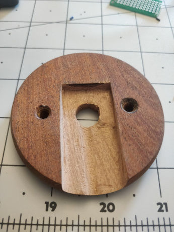
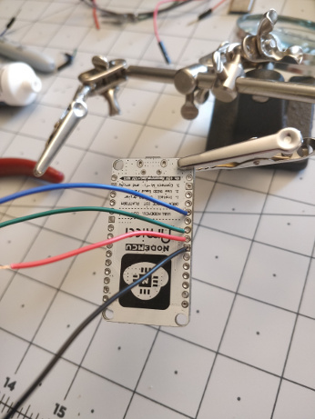
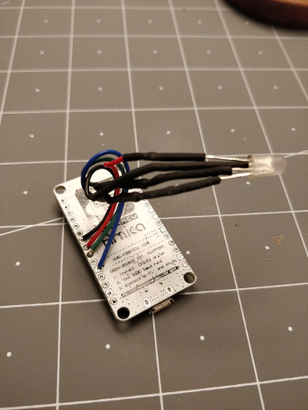
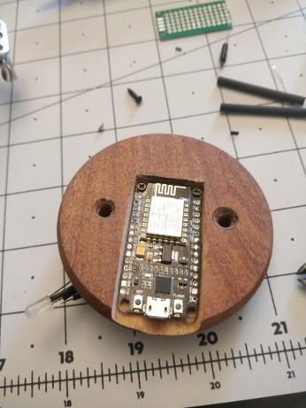
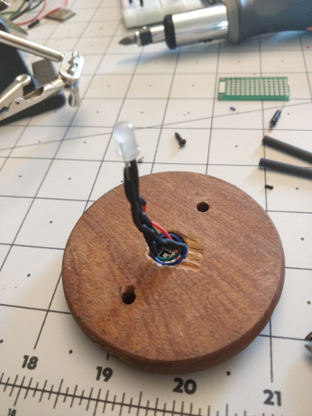
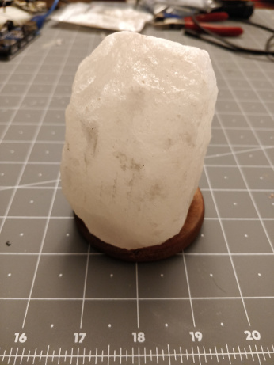
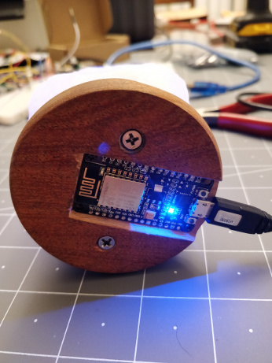
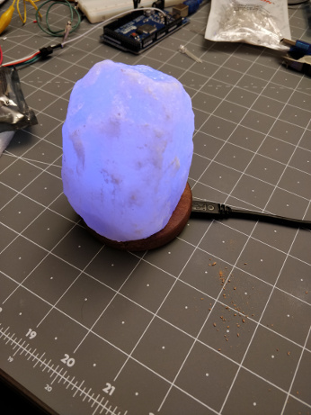

# esp-twitter-lamp
ESP8266 based smart lamp which searches Twitter and flashes different colors depending on tweets. If the word Cassandra is found the lamp will flash blue. If MongoDB is found it will flash green. And if Datastax is found it will flash red.

## Lamp Usage
The lamp has 3 states
1. **Setup**
With the built in LED *on* and the lamp lit *solid white* without fading. The lamp is in setup mode. The lamp will be acting as a Wifi access point transmitting SSID esp-lamp. After 3 minutes if the lamp has not been configured it will enter state #2.

2. **Unconfigured**
With the built in LED *on* and the lamp *fading white* in and out. The lamp is in unconfigured mode. In this state the lamp is not connected to the Internet and is not searching twitter. Reset the lamp to enter state #1 so it can be configured with Internet access.

3. **Active**
With the built in LED *off* and the lamp *fading different colors* in and out. The lamp is in active mode. In this mode the lamp is searching twitter periodically and flashing different colors depending on tweets.

On initial startup the lamp will attempt to connect to previously configured Wifi networks. If a known Wifi network is found. The lamp will connect and enter state #3 (active).

On initial startup If no known Wifi networks are found. The lamp enters state #1 (setup) and can be setup by connecting to its SSID "esp-lamp". After 3 minutes in state #1 the lamp will enter state #2 (unconfigured). In order to leave state #2 the lamp must be restarted so it can be configured.

#### Wifi configuration

When the lamp is in state #1 you need to connect to its SSID and configure the Wifi network it can use for Internet access. After connecting to the esp-lamp SSID you will be prompted to "sign into network." If no prompt appears navigate to 192.168.4.1 with a web browser to configure.

Follow the steps to configure the lamp's Wifi settings. If configuration is not working you can press the reset button twice within 5 seconds to clear Wifi settings and try again.

## Making the Lamp

### Hardware

**Components**
- [NodeMCU 1.0 ESP8266 dev board](https://www.amazon.com/gp/product/B07CB4P2XY/ "NodeMCU 1.0 ESP8266 dev board")
- [Salt Lamp](https://www.amazon.com/gp/product/B0719MYVZ6/ "Salt Lamp")
- [RGB LED](https://www.amazon.com/Tricolor-Multicolor-Lighting-Electronics-Components/dp/B01C19ENFK "RGB LED")
- 3x 120 ohm resistors

Dissamble the salt lamp and discard the included LED. Cut out a slot in the wooden base to install the ESP module into.



On the ESP module, de-solder the header pins. Solder wires on pins D5 (red), D6 (green), and D8 (blue) for RGB connections to the LED. And solder a gound wire onto the ground pin next to D5.



Then solder the resistors and LEDs onto the other end of the wires. Ensure you connect the wires onto the correct pins of the RGB LED.



Install the ESP module into the slot you carved out of the base and feed the LED and wires through the center hole.





Reattach the top of the lamp. Now the lamp is ready for programming.







### Software
**Requirements**
- [ Arduino IDE (version 1.8.5 or newer)](https://www.arduino.cc/en/Main/Software " Arduino IDE (version 1.8.5 or newer)")
- [ESP8266 Board Core](https://github.com/esp8266/Arduino "ESP8266 Board Core")
- [WifiManager lib](https://github.com/tzapu/WiFiManager "WifiManager lib")
- [DoubleReset lib](https://github.com/datacute/DoubleResetDetector "DoubleReset lib")
- [Arduino JSON lib](https://github.com/bblanchon/ArduinoJson "Arduino JSON lib")
- [TwitterWebAPI lib](https://github.com/debsahu/TwitterWebAPI "TwitterWebAPI lib")
- [Twitter App API keys](https://www.slickremix.com/docs/how-to-get-api-keys-and-tokens-for-twitter/ "Twitter App API keys")

After you have all the requirements installed. Create a new sketch with the esp-lamp.ino file. Find the twitter auth section and enter in your API keys
```
// twitter auth
static char const consumer_key[]    = "";
static char const consumer_sec[]    = "";
static char const accesstoken[]     = "";
static char const accesstoken_sec[] = "";
```

Then Compile and upload the sketch.
